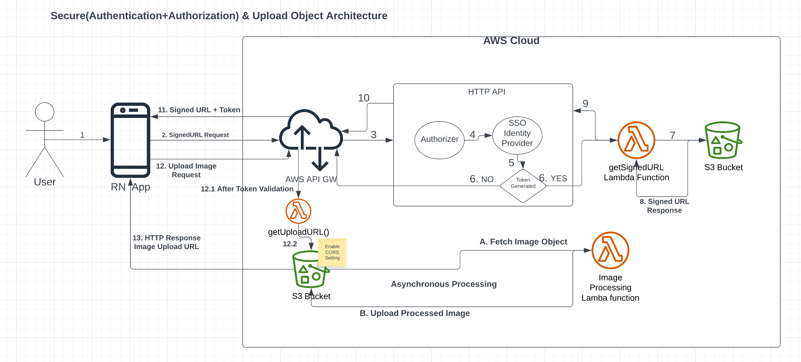

## Solution To Manage Assests Using Secure Upload Process 
Following are the high level steps to explain the solution. These steps are explained in detail in the below sections. 
- The RN app should upload the images/videos in Cloud services, in our case it's AWS.
- The AWS S3 bucket will provide you the image URL and this URL you should store in the backend database as a referecne or metadata to access the images whenever you need it. 
- For uploading it's better to implement mullti-part uploading and we can leverage dedicated node module for the same like `aws-sdk` which also take care of assembling these parts into the original image out of the box. 
- In the RN app for user to access the images either via Camera or Gallery, it's better if we use some node modules which are specialized in this work. Example: `react-native-image-picker`, `react-native-fast-image`, `react-native-async-storage` & `react-native-fs`. 
- Once the required images are accessed from the user then we can cache these images for users to offline access for a given interval of time. 
- In case the user goes offline or brittle network connection, user should be able to submit these images on demand. In fact it's even better if we build an offline upload & notification solution on top of this solution which will submit these images on behalf of user and notification the user. This will be very effective in case of offline scenario. 

### Secure(Autentication+Authorization) & Upload Object Architecture

- User clicks Submit CTA. 
- Send a HTTP GET request to get preSigned URL.
- Pre-Signed URLs
   *  Instead of directly uploading files to S3 through your API, generate a pre-signed URL. A pre-signed URL is a temporary URL that grants users permission to upload a file to a specific S3 bucket.
- Implement Authenitcation
   * Ensure that only authenticated users can request pre-signed URLs. 
   * AWS API GW sends the request to HTTP API. This API is created in AWS to incorporate OAuth based Authentication via SSO Identity Provider. 
   * If user is signed in successfully (Bearer Token generated successfully) then only request will go further to get pre-signed URL else the request will be failed and return HTTP 401 error response. 
- Lambda Function 
   * The request will trigger getSignedURL Lamda Function and this lambda function gets the SignedURL from S3 bucket. 
   * The retuned HTTP response will contain the Authenticated Token and the PreSignedURL which contains the AWS access key as well. 
- Make the HTTP PUT upload request to the preSignedURL endpoint to API GW.
- API GW will validate the Auth Token in the request and then only forward the request else HTTP 401 error is returned. 
- If Auth Token is valid then the request is forwarded to getUploadURL Lambda function, this ensures only authenticated user can upload objects to S3 bucket. 
- Finally the uploaded S3 buket Image URL is returned in the HTTP response. 
- This URL can be saved in Backend Database as a Metadata to access the object from S3 anytime in the future. 
- Optional and Good to have Feature
   * We can implement Asynchronous Image Processing Lambda Function, which can retrieve the Image from desired S3 bucket and then do the image processing like Crop, Resize etc... and upload back the processed object. 

### Best Practices
- Limit file size
   * To prevent users from uploading extremely large files, set a maximum file size limit when generating the pre-signed URL. This can be done using the `Content-Length` header in the pre-signed URL request.
- Authorization
   * Configure the S3 bucket policies and CORS settings to allow only specific actions (e.g., `s3:PutObject`) from specific domains or users. This helps prevent unauthorized access to your S3 bucket.
- Encrypt data
   * Enable server-side encryption for your S3 bucket to protect the stored data. Amazon S3 supports several encryption options, such as SSE-S3, SSE-KMS, or SSE-C.
- Use short expiration times
   * Set a short expiration time for the pre-signed URLs, such as 5 or 10 minutes. This limits the time window in which an attacker could potentially use the URL.
- Monitor and log activity
   * Use AWS CloudTrail and S3 access logs to monitor and log all activities related to your S3 bucket. This helps you track any unauthorized access or suspicious activities.

### Would you use react query to handle image processing & uploading?
- React Query is an excellent library for fetching, caching & state management. However, it may not be the best choice for handling image processing and uploading, as its primary focus is on data fetching and state management. For image processing and uploading, you can consider using AWS services/libraries that are specifically designed for this purpose. Ex: `aws-sdk` javascript module can upload and manage images in S3. 
- AWS Lambda: AWS Lambda is a serverless compute service that lets you run your code without provisioning or managing servers. You can use Lambda to create a function that processes images (resizing, cropping, etc.) and uploads the processed images to Amazon S3.
- You can still integrate this with React Query for fetching and displaying the images in your application. This way, you can benefit from React Query's caching and state management features while using specialized module for handling image processing and uploading tasks.

### How would you cache and store existing images from existing workflow instance steps for offline access?
Use react-native-fast-image module along with react-native-async-storage or react-native-fs module. react-native-fast-image is used to cache & render the image while react-native-async-storage/async-storage or react-native-fs module can be used to store the image for offline access. 
Here is the code snippet for reference - 
```
import FastImage from 'react-native-fast-image';
import AsyncStorage from '@react-native-async-storage/async-storage';
import RNFS from 'react-native-fs';

async function cacheImage(url) {
  try {
    const cacheKey = `cache_${url}`;
    const cachedPath = await AsyncStorage.getItem(cacheKey);

    if (cachedPath) {
      return cachedPath;
    }

    const downloadPath = `${RNFS.CachesDirectoryPath}/${cacheKey}`;
    await RNFS.downloadFile({ fromUrl: url, toFile: downloadPath }).promise;

    await AsyncStorage.setItem(cacheKey, downloadPath);
    return downloadPath;
  } catch (error) {
    console.error('Error caching image:', error);
    return url;
  }
}
Use the cached images:

import React, { useState, useEffect } from 'react';
import FastImage from 'react-native-fast-image';

const CachedImage = ({ source, ...props }) => {
  const [cachedSource, setCachedSource] = useState(null);

  useEffect(() => {
    async function loadCachedImage() {
      const cachedPath = await cacheImage(source.uri);
      setCachedSource({ uri: cachedPath });
    }

    loadCachedImage();
  }, [source]);

  return <FastImage source={cachedSource || source} {...props} />;
};
Use the CachedImage component in the App - 

import React from 'react';
import { View } from 'react-native';
import CachedImage from './CachedImage';

const App = () => {
  return (
    <View>
      <CachedImage
        source={{ uri: 'https://example.com/image.jpg' }}
        style={{ width: 100, height: 100 }}
      />
    </View>
  );
};

export default App;

```

### How would you monitor the upload process for each asset? What are the failure points? How would you handle them?
- Use AWS CloudTrail to monitor upload S3 & S3 Logs access.
- Failure points during upload S3 - There are several potential failure points during S3 upload image.
   * Network connectivity issues: If there are network connectivity issues, the upload process may fail or take longer than expected. 
   * Insufficient permissions: If the user does not have sufficient permissions to upload files to the S3 bucket, the upload process will fail.
   * Incorrect bucket name or region: If the bucket name or region is incorrect, the upload process will fail.
   * File size limitations: If the file size exceeds the maximum allowed size for the S3 bucket, the upload process will fail.
   * Timeouts: If the upload process takes too long to complete, it may time out and fail.
   * Server-side errors: Server-side errors such as internal server errors or service unavailable errors can also cause the upload process to fail.
- Upload Failure Handling
   * Use multipart upload: If you're uploading large files, it's recommended to use multipart upload using built-in multi-upload feature with `aws-sdk`. This allows you to split the file into smaller parts and upload them separately. If one part fails, you can retry just that part instead of starting the entire upload again.
   * Implement retries: You can implement retries in your code to automatically retry the upload if it fails. You can set a maximum number of retries to avoid getting stuck in an infinite loop. 
   * Use exponential backoff: When retrying, you can use exponential backoff to avoid overwhelming the server with too many requests. This means that you start with a small delay between retries and gradually increase it with each retry.
   * Use `AWS SDKs`: If you're using `AWS SDKs`, they come with built-in error handling and retry mechanisms.


